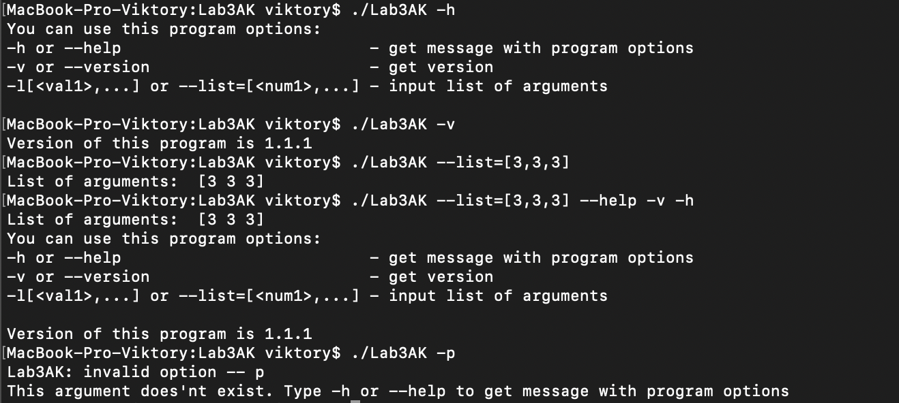

# Lab3AK

#### You can use this program options:

-    -h            or --help                          - get message with program options
-    -n            or --name                          - get file name
-    -v            or --version                       - get version
-    -l[value,...] or --list=[value,...]              - input list of arguments

